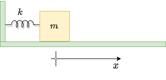

## Practice setting up numerical solutions to Newton's Laws

## Simple Harmonic Oscillator

For the system shown, the system can be described by the position and velocity ($x$ and $v = \dot x$). The acceleration of the system is, of course, $a =\ddot x$.

​	a) Write down Newton's second law:

​	

​	b) Separate into two first order equations: 

​	

​	c) Now replace $dt$, $dv$, $dx$ with $\Delta t$, $\Delta v$, $\Delta x$ and solve each of the above two equations for $\Delta x$ and $\Delta v$.

​	d) Write down the Euler method solution and the Euler-Cromer method solution for this system.
